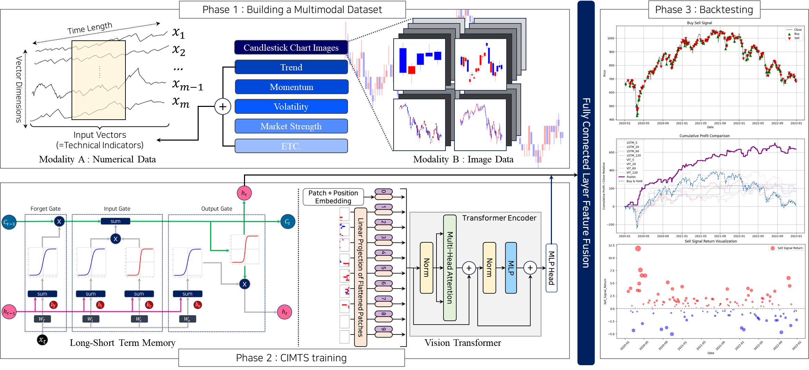
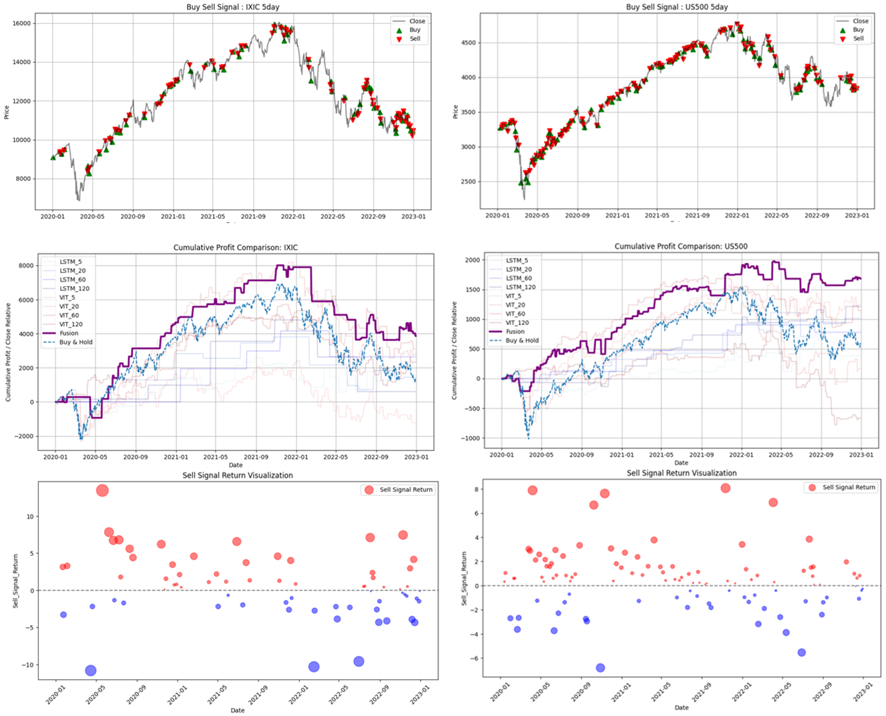
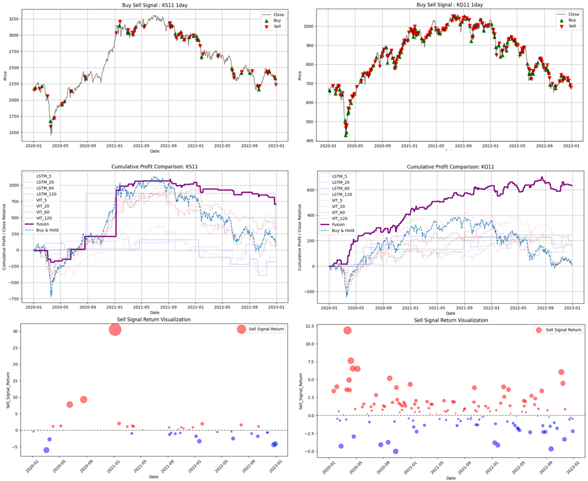

# Multimodal-v1-CIMTS
CIMTS: A Candlestick-Integrated Multimodal Trading System for Stock Indices

## Abstract
Stock price analysis based solely on technical indicators, such as in traditional stock price prediction studies, relies heavily on observations from individual sample markets and fails to consider insights from other modalities. Thus, it is imperative to study the implicit interdependence between different modalities. This study proposes a candlestick-integrated multimodal trading system (CIMTS) that integrates candlestick chart image data and multimodal data by running the long short-term memory (LSTM) and vision transformer models in parallel and identifying graphical signals of stock prices using a late fusion approach to merge the outputs from the two models. The system is tested using approximately 12 years of data from key US and Korean stock indices, including the NASDAQ Composite, S&P500, KOSPI, and KOSDAQ, under different market conditions. The experiment results showed that CIMTS outperformed the single-modality models in terms of aggressiveness and stability. In particular, the CIMTS outperformed the labeling method that considers next-day movements in the Korean market and the 5-day consecutive trend in the US market, achieving the best cumulative return of 95.47% on the KOSDAQ.

## Model Framework

## Backtesting Summary
#### NASDAQ, S&P500

#### KOSPI, KOSDAQ
